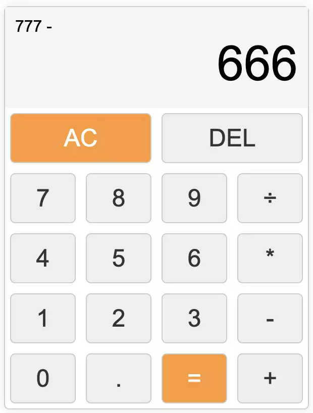

# Unicorn-Traineeships Demo app JavaScript Calculator
First lecture in Javascript for Unicorn traineeship (May-2023)

# To run project in Codespaces:

Than lets install _http-server_:

    npm i -g http-server
and then run following command to start server on port :8080:

    http-server

Now you can just click on Open in brewser button or find our app link in *PORTS* tab.

